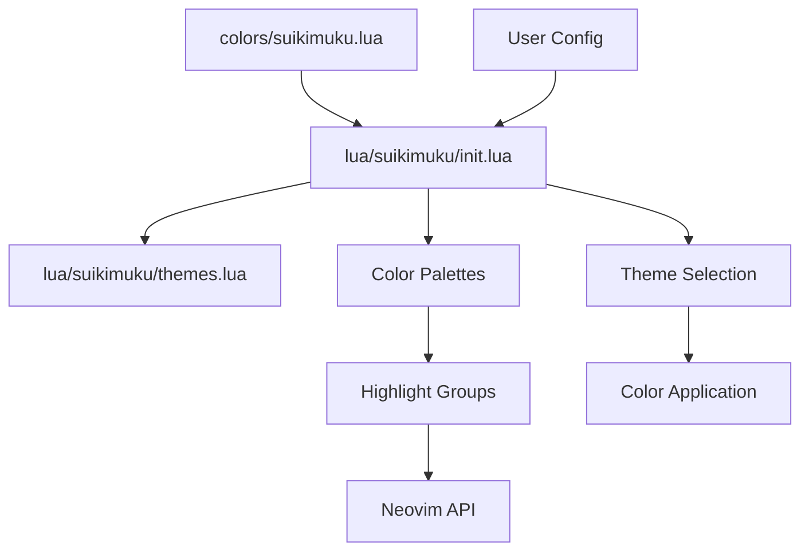
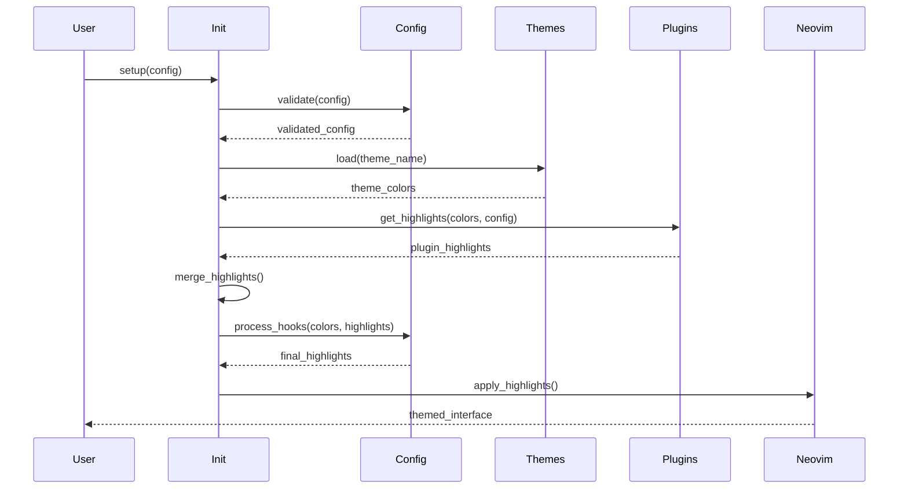

# Technical Architecture

*Comprehensive system design for Suikimuku.nvim's extensible theming framework*

## System Overview

Suikimuku.nvim is designed as a comprehensive, extensible Neovim theming framework that maintains aesthetic integrity across four distinct themes while providing extensive customization capabilities and plugin ecosystem support.

## Current Architecture Analysis

### Directory Structure (Current)
```
suikimuku.nvim/
├── colors/
│   └── suikimuku.lua          # Standard colorscheme entry point
├── lua/suikimuku/
│   ├── init.lua               # Main plugin logic and color definitions  
│   └── themes.lua             # Raw color palette definitions
├── docs/                      # Documentation (new)
├── test-themes.lua            # Theme testing utility
├── theme-preview.html         # Web-based theme preview
└── README.md                  # User documentation
```

### Current Component Architecture



### Strengths of Current Design
- **Clean separation**: Logic separated from data
- **Standard compliance**: Proper colorscheme integration
- **Multi-theme support**: Four distinct aesthetic approaches
- **Transparency handling**: Built-in transparency management
- **Configuration system**: Basic user customization

### Architectural Limitations
- **Monolithic structure**: All logic in single file
- **Limited extensibility**: No plugin-specific support
- **Static color system**: No programmatic color manipulation
- **Basic configuration**: Simple table merging without validation
- **No modularity**: Difficult to extend or customize

## Proposed Architecture (Optimized)

### Enhanced Directory Structure
```
suikimuku.nvim/
├── colors/
│   └── suikimuku.lua          # Standard entry point
├── lua/suikimuku/
│   ├── init.lua               # Main orchestration and public API
│   ├── config.lua             # Configuration management and validation
│   ├── util.lua               # Color utilities and helper functions
│   ├── themes/                # Modular theme definitions
│   │   ├── init.lua           # Theme loader and manager
│   │   ├── sui.lua            # Digital Aquarium theme
│   │   ├── ki.lua             # Crystal Radiant Light theme
│   │   ├── mu.lua             # WCAG AAA Grayscale theme
│   │   └── ku.lua             # Enhanced Vibrant Terminal theme
│   └── plugins/               # Plugin-specific integrations
│       ├── init.lua           # Plugin manager and loader
│       ├── telescope.lua      # Telescope integration
│       ├── nvim-tree.lua      # File explorer integration
│       ├── lualine.lua        # Status line integration
│       ├── cmp.lua            # Completion integration
│       ├── gitsigns.lua       # Git integration
│       └── ... (additional plugins)
├── docs/                      # Comprehensive documentation
├── tests/                     # Automated testing suite
└── extras/                    # Additional utilities and tools
    ├── theme-preview.html     # Web preview tool
    ├── export/                # Theme export utilities
    └── templates/             # Plugin template generators
```

## Core Components Architecture

### 1. Main Orchestration Layer (`init.lua`)

**Responsibility**: Public API, theme coordination, and system integration

```lua
-- High-level architecture overview
local M = {}

-- Core modules
local config = require('suikimuku.config')
local themes = require('suikimuku.themes')
local plugins = require('suikimuku.plugins')
local util = require('suikimuku.util')

-- Public API
function M.setup(user_config) end
function M.load(theme_name) end  
function M.get_colors(theme_name) end
function M.get_highlights(theme_name, user_config) end

-- Extension API
function M.register_theme(name, definition) end
function M.register_plugin(name, highlight_fn) end
function M.export_theme(format, options) end

return M
```

**Key Features**:
- Clean public API surface
- Lazy loading of sub-modules
- Error handling and validation
- Backward compatibility management
- Extension point registration

### 2. Configuration Management (`config.lua`)

**Responsibility**: Configuration validation, defaults, and user customization hooks

```lua
local M = {}

-- Default configuration with full type definitions
M.defaults = {
  -- Core theme settings
  style = 'ku',           -- Theme selection
  transparent = false,    -- Background transparency
  opacity = 0.64,         -- Transparency level
  monochrome = false,     -- Force grayscale
  
  -- Style customization
  styles = {
    comments = { italic = true },
    keywords = { bold = true },
    functions = {},
    variables = {},
    types = {},
  },
  
  -- Plugin configuration
  plugins = {
    -- Core plugins
    telescope = true,
    nvim_tree = true,
    lualine = true,
    gitsigns = true,
    cmp = true,
    whichkey = true,
    
    -- Plugin-specific options
    telescope = {
      style = 'bordered',    -- 'bordered', 'borderless'
      transparency = nil,    -- Override global transparency
    },
    nvim_tree = {
      darker = false,        -- Darker background
    },
  },
  
  -- Advanced customization hooks
  on_colors = function(colors) end,
  on_highlights = function(highlights, colors) end,
}

-- Configuration validation and processing
function M.validate(user_config) end
function M.merge(user_config) end
function M.process_hooks(config, colors, highlights) end

return M
```

**Architecture Benefits**:
- Type safety through validation
- Extensible configuration schema
- User customization hooks
- Plugin-specific configuration
- Runtime configuration updates

### 3. Color Utility System (`util.lua`)

**Responsibility**: Color space manipulation, calculations, and accessibility

```lua
local M = {}

-- Color space conversion
function M.hex_to_rgb(hex) end
function M.rgb_to_hex(r, g, b) end
function M.hex_to_hsl(hex) end
function M.hsl_to_hex(h, s, l) end

-- Color manipulation
function M.darken(color, amount) end
function M.lighten(color, amount) end
function M.saturate(color, amount) end
function M.desaturate(color, amount) end
function M.blend(color1, color2, ratio) end
function M.complement(color) end
function M.analogous(color, count) end

-- Accessibility and validation
function M.get_contrast_ratio(fg, bg) end
function M.is_accessible(fg, bg, level) end  -- 'AA', 'AAA'
function M.ensure_contrast(fg, bg, level) end
function M.validate_color(color) end

-- Advanced operations
function M.generate_palette(base_color, options) end
function M.interpolate(color1, color2, steps) end
function M.harmony(base_color, type) end  -- 'triadic', 'tetradic', etc.

return M
```

**Technical Features**:
- Multiple color space support (RGB, HSL, future: LAB, LCH)
- Accessibility compliance validation
- Color harmony generation
- Batch processing capabilities
- Performance-optimized calculations

### 4. Theme Management System (`themes/`)

**Responsibility**: Theme definitions, variants, and loading

#### Theme Loader (`themes/init.lua`)
```lua
local M = {}

-- Theme registry
local themes = {}
local variants = {}

-- Core theme registration
function M.register(name, definition) end
function M.register_variant(theme, variant, modifications) end
function M.load(name, variant) end
function M.get_all() end
function M.validate_theme(definition) end

-- Dynamic theme operations
function M.create_variant(base_theme, modifications) end
function M.merge_themes(base, overlay) end
function M.export_theme(theme, format) end

return M
```

#### Individual Theme Modules
```lua
-- themes/sui.lua (Digital Aquarium)
return {
  -- Metadata
  meta = {
    name = 'Digital Aquarium',
    description = 'Serene underwater workspace with bioluminescent syntax',
    author = 'Suikimuku.nvim',
    version = '1.0.0',
  },
  
  -- Theme configuration
  config = {
    default_transparent = false,
    supports_variants = true,
    accessibility_level = 'AA',
  },
  
  -- Color palette
  palette = {
    -- Background colors
    bg = {
      primary = '#0A1B1A',
      secondary = '#0F2A28',
      float = '#1A3E3B',
      highlight = '#2A5651',
    },
    
    -- Foreground colors
    fg = {
      primary = '#A7DBD8',
      secondary = '#7BBAB1', 
      muted = '#C8E6F5',
      subtle = '#7BBAB1',
    },
    
    -- Syntax colors
    syntax = {
      func = '#69D2E7',
      keyword = '#1e9ee8',
      string = '#52C489',
      type = '#A7DBD8',
      const = '#F38630',
      special = '#bce089',
    },
    
    -- Diagnostic colors
    diagnostic = {
      error = '#F38630',
      warn = '#FA6900', 
      info = '#69D2E7',
      hint = '#52C489',
    },
    
    -- Extended palette for plugins
    extended = {
      selection = '#2A5651',
      search = '#335cff',
      visual = '#1A3E3B',
      cursor = '#69D2E7',
    },
  },
  
  -- Theme-specific customizations
  customizations = {
    -- Plugin-specific overrides
    telescope = {
      border_style = 'rounded',
      transparency = 0.9,
    },
    
    -- Style modifications
    styles = {
      comments = { italic = true },
      keywords = { bold = false },
    },
  },
  
  -- Variant definitions
  variants = {
    storm = {
      palette = {
        bg = {
          primary = '#0A1B1A',  -- Darker variant
          -- ... other modifications
        },
      },
    },
  },
}
```

### 5. Plugin Integration System (`plugins/`)

**Responsibility**: Third-party plugin theming and compatibility

#### Plugin Manager (`plugins/init.lua`)
```lua
local M = {}

-- Plugin registry
local registered_plugins = {}
local loaded_plugins = {}

-- Plugin management
function M.register(name, highlight_function) end
function M.load_for_theme(theme_name, config) end
function M.get_available() end
function M.is_plugin_available(name) end

-- Dynamic loading
function M.lazy_load(plugin_name) end
function M.reload_plugin(plugin_name) end
function M.validate_plugin(plugin_definition) end

-- Plugin detection
function M.detect_installed_plugins() end
function M.auto_configure() end

return M
```

#### Plugin Integration Pattern
```lua
-- plugins/telescope.lua
return {
  -- Plugin metadata
  meta = {
    name = 'telescope.nvim',
    min_version = '0.1.0',
    description = 'Fuzzy finder integration',
  },
  
  -- Detection function
  detect = function()
    return pcall(require, 'telescope')
  end,
  
  -- Configuration schema
  config_schema = {
    style = { type = 'string', enum = { 'bordered', 'borderless' } },
    transparency = { type = 'number', min = 0, max = 1 },
  },
  
  -- Highlight generation function
  generate_highlights = function(colors, config, util)
    local highlights = {}
    
    -- Base highlights
    highlights.TelescopeNormal = {
      fg = colors.fg.primary,
      bg = config.transparent and 'NONE' or colors.bg.float
    }
    
    -- Theme-specific customizations
    if config.theme == 'sui' then
      highlights.TelescopeSelection = { 
        bg = colors.extended.selection,
        fg = colors.syntax.func
      }
    end
    
    return highlights
  end,
  
  -- Setup function (optional)
  setup = function(colors, config)
    -- Plugin-specific setup logic
  end,
}
```

## Data Flow Architecture

### Theme Application Flow



### Configuration Processing Pipeline


## Extensibility Architecture

### Theme Extension Points

1. **Color Manipulation**: Users can modify colors through hooks
2. **Highlight Customization**: Override specific highlight groups
3. **Plugin Integration**: Add custom plugin support
4. **Theme Variants**: Create theme modifications
5. **Export System**: Generate themes for other tools

### Plugin Developer API

```lua
-- Public API for plugin developers
local suikimuku = require('suikimuku')

-- Register custom plugin support
suikimuku.register_plugin('my_plugin', function(colors, config, util)
  return {
    MyPluginNormal = { fg = colors.fg.primary },
    MyPluginHighlight = { bg = util.darken(colors.bg.highlight, 0.1) },
  }
end)

-- Register custom theme
suikimuku.register_theme('my_theme', {
  palette = { /* color definitions */ },
  config = { /* theme config */ },
})

-- Hook into color generation
suikimuku.setup({
  on_colors = function(colors, theme)
    if theme == 'sui' then
      colors.syntax.func = colors.util.lighten(colors.syntax.func, 0.1)
    end
  end,
  
  on_highlights = function(highlights, colors, theme)
    highlights.Comment = { 
      fg = colors.fg.muted, 
      italic = theme ~= 'mu' 
    }
  end,
})
```

## Performance Architecture

### Optimization Strategies

1. **Lazy Loading**: Load components only when needed
2. **Caching**: Cache computed highlights and colors
3. **Selective Updates**: Update only changed components
4. **Memory Management**: Cleanup unused data
5. **Batch Operations**: Process multiple changes together

### Performance Monitoring

```lua
-- Performance tracking system
local perf = {}

function perf.measure(name, fn)
  local start = vim.loop.hrtime()
  local result = fn()
  local duration = (vim.loop.hrtime() - start) / 1e6  -- Convert to ms
  
  perf.log(name, duration)
  return result
end

-- Performance targets
-- - Theme loading: <50ms
-- - Plugin highlight generation: <20ms per plugin
-- - Configuration validation: <10ms
-- - Color calculations: <1ms per operation
```

## Quality Architecture

### Testing Strategy

1. **Unit Tests**: Individual component testing
2. **Integration Tests**: Cross-component functionality
3. **Visual Tests**: Screenshot-based theme validation
4. **Performance Tests**: Benchmark critical operations
5. **Compatibility Tests**: Plugin integration validation

### Code Quality Measures

1. **Type Checking**: Full Lua type annotations
2. **Static Analysis**: Code quality validation
3. **Documentation**: Comprehensive inline documentation
4. **Examples**: Working code examples for all features
5. **Migration Guides**: Upgrade path documentation

## Security Architecture

### Configuration Security

- Input validation and sanitization
- Safe evaluation of user functions
- Resource usage limits
- Error handling and recovery

### Plugin Security

- Sandboxed plugin execution
- Capability-based permissions
- Safe color value parsing
- Memory usage monitoring

## Migration Architecture

### Backward Compatibility

```lua
-- Compatibility layer for existing configurations
local compat = {}

function compat.migrate_config(old_config)
  local new_config = {}
  
  -- Handle renamed options
  if old_config.variant then
    new_config.style = old_config.variant
  end
  
  -- Handle deprecated options
  if old_config.italic_comments ~= nil then
    new_config.styles = new_config.styles or {}
    new_config.styles.comments = { italic = old_config.italic_comments }
  end
  
  return new_config
end
```

### Version Management

- Semantic versioning for API changes
- Deprecation warnings for removed features
- Migration utilities for major upgrades
- Rollback capabilities for failed upgrades

## Future Architecture Considerations

### Scalability Planning

- Support for unlimited themes and variants
- Dynamic plugin loading and unloading
- Real-time theme switching without restart
- Multi-instance theme management

### Technology Evolution

- LSP-based theme validation
- Web-based configuration interface  
- AI-assisted color generation
- Cross-editor theme synchronization

This architecture provides a solid foundation for Suikimuku.nvim's evolution into a comprehensive, extensible theming platform while maintaining performance, reliability, and user experience excellence.